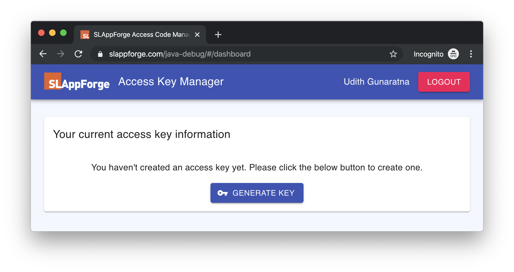
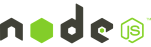

# SLAppForge Lambda Debugging Workshops

This repository contains a collection of workshops and other hands on content that will guide you on how to utilize 
SLAppForge Lambda Debugging Toolkit to remote debug live running AWS Lambda functions.

## Prerequisites

As a prerequisite for using the SLAppForge Lambda Debugging Toolkit for these workshops, you should obtain an access key 
pair from the SLAppForge Access Key Manager. For that please follow the below mentioned steps.

* Visit [SLAppForge Access Key Manager](https://www.slappforge.com/java-debug) and login with your 
[SLAppForge Sigma](https://www.slappforge.com/sigma) account credentials. If you don't have a Sigma account yet, you can 
register for a **free account** from [here](https://sigma.slappforge.com/#/signup).

* Once login, you can click on the **GENERATE KEY** button to generate set of credentials to be used with SLAppForge 
Lambda Debugging Toolkit.

* Then you will be presented with a set of credentials as follows, and you can re-generate a new secret again at any 
time. You may copy these **Access Key** and **Access Secret** to be used during the workshops later.

---

## Workshops

### [**Java Lambda Debugging**](java-debugging)

This workshop shows how to setup SLAppForge Lambda Debugging Toolkit for live debugging Java based Lambda functions with
IDEs such as IntelliJ IDEA and Eclipse.

### [**NodeJS Lambda Debugging**](nodejs-debugging)

This workshop shows how to setup SLAppForge Lambda Debugging Toolkit for live debugging NodeJS based Lambda functions with
IDEs such as WebStorm,IntelliJ IDEA and Visual Studio Code.

