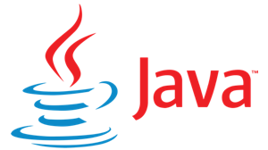
# Java Lambda Debugging Workshop

Prerequisites
 - A Java IDE such as IntelliJ IDEA (Eclipse or NetBeans)
 - JDK 8 or above with Maven and Git
 - AWS account with access to deploy Lambda functions and post to SQS
 - SLAppForge access key 
   - Register [here](https://sigma.slappforge.com/#/signup) for a free SLAppForge account
   - Then access the Access Key Manager [here](https://www.slappforge.com/java-debug) to generate keys for debugging

### Overview

This example shows how to setup a standard Java IDE - such as IntelliJ IDEA, Eclipse or NetBeans - to debug Lambda functions as they execute live within the real AWS runtime environment. We will use a simple Lambda function that will post a message to an SQS queue, which we will debug during execution to modify the message just before being posted.

## 1. Clone the sample repository and set the SQS queue name

First clone this repository to your local machine and open the `sample-lambda-code` sub-directory with your IDE.
This directory contains a sample lambda function named `SQSPublisher`, which extracts a message from the Lambda event and then publishes it to a pre-defined SQS queue.

### Setting the SQS URL

For this to sample to work, you need to have a SQS queue created in your AWS account.
For that, log into the SQS (Simple Queue Service) console of your AWS account and create a new SQS queue.
After the queue is created, set it into the SQS_URL variable at the top of the `SQSPublisher` class.
You may also use an existing queue for this exercise.

```
final String SQS_URL = "asankha-java-demo";
```
## 2. Creating and configuring the Lambda function

### Create a new Lambda function

Login to the AWS Lambda Console and create a new Lambda function using Java 8 or 11 as the runtime. Let's name it as **SQSPublisher**. For the execution role configuration, choose the **Create a new role with basic Lambda permissions** option.

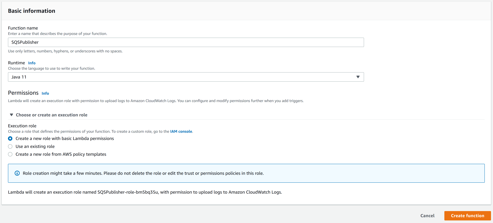

### Build and upload the code

Once the Lambda function is created, scroll down to the **Function code** section and choose the **Code Entry Type** as **Upload a .zip file**. Then build the code using Maven (“mvn package”), and upload the resulting JAR artifact “java-debug-samples-1.0-SNAPSHOT.jar” created in the target directory, as the function zip file. Then set the **Handler** to “**sample.SQSPublisher::handleRequest**” and save the function.

```
asankha@ASANKHA-HP:~/code/java-debugging-workshop$ cd sample-lambda-code/
asankha@ASANKHA-HP:~/code/java-debugging-workshop/sample-lambda-code$ mvn package
…
[INFO] Building jar: /mnt/c/Users/Asankha/code/java-debugging-workshop/sample-lambda-code/target/java-debug-samples-1.0-SNAPSHOT.jar
…
[INFO] Replacing original artifact with shaded artifact.
[INFO] Replacing /mnt/c/Users/Asankha/code/java-debugging-workshop/sample-lambda-code/target/java-debug-samples-1.0-SNAPSHOT.jar with /mnt/c/Users/Asankha/code/java-debugging-workshop/sample-lambda-code/target/java-debug-samples-1.0-SNAPSHOT-shaded.jar
[INFO] ------------------------------------------------------------------------
[INFO] BUILD SUCCESS
[INFO] ------------------------------------------------------------------------
[INFO] Total time: 4.490 s
[INFO] Finished at: 2020-02-06T14:52:47+05:30
[INFO] ------------------------------------------------------------------------
asankha@ASANKHA-HP:~/code/java-debugging-workshop/sample-lambda-code$
```

### Grant SQS publish permission

Since the Lambda function is supposed to publish messages to the SQS queue, SQS publishing permission should be granted to the Lambda execution role. For that, switch to the **Permissions** tab on the Lambda function console and click on the **Manage these permissions on the IAM console** link.

Once the Lambda execution role is opened in the AWS IAM console,
add a new inline policy by clicking on the **Add Inline Policy** link and set the following parameters.

| Parameter | Value |
|-----------|--------|
|Service    |**SQS** |
|Actions    |**Write -> SendMessage** |
|Resources  |ARN of the SQS queue or All resources|

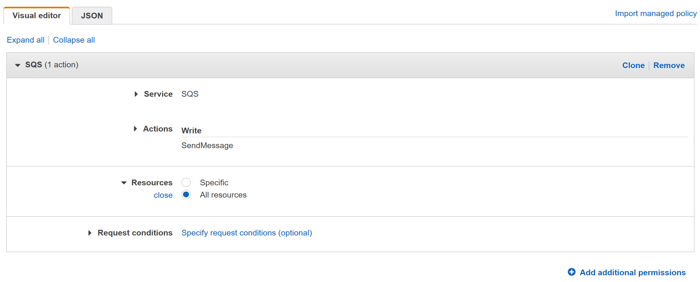

Then save the policy by giving it a name such as **SQSWritePolicyAll**,
and then back in the Lambda function configuration you should be able to see this policy being applied, once you refresh your page.

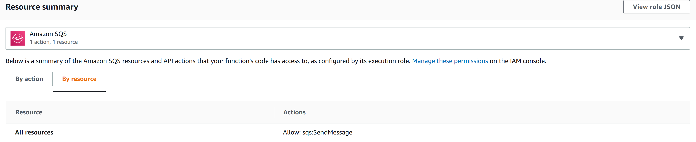

### Create a test event

To invoke the Lambda function, create a new **Test Event** on the Lambda console with a sample input string
(e.g. `"Hello World"`) as shown below.

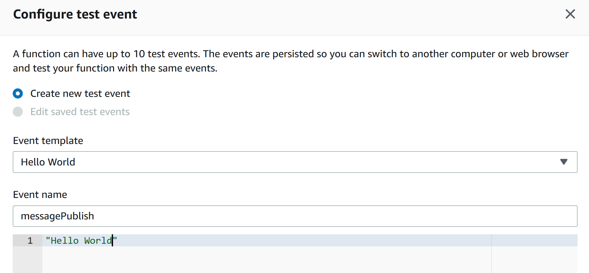

When invoked, an output similar to the following should be seen if everything executes successfully.

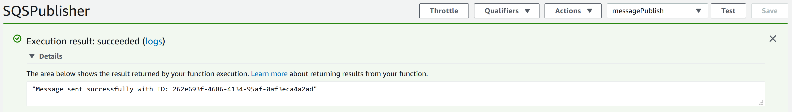

## 3. Configuring for live remote debugging

This section assumes that you now have a working Lambda function implemented in Java, and need to debug its execution remotely from your local IDE, while it executes live on the AWS environment.

### Configure Lambda environment variables

The following environment variables must be set for the Lambda function with the appropriate values. These are used by the debug proxy to decide whether to enable debug mode and also to connect with the broker server.

| Name | Required | Description  |
|------|:--------:| -------------|
|`SLAPP_KEY` |:white_check_mark: | This is the Access Key obtained from the access key manager
|`SLAPP_SECRET` |:white_check_mark: | This is the Access Secret obtained from the access key manager
|`SLAPP_SESSION` |:white_check_mark: | This is a unique ID to distinguish this Lambda function for debugger to connect. This can be any string value.
|`SLAPP_DISABLE` | | Set this to `true` to disable debugging with just one step.

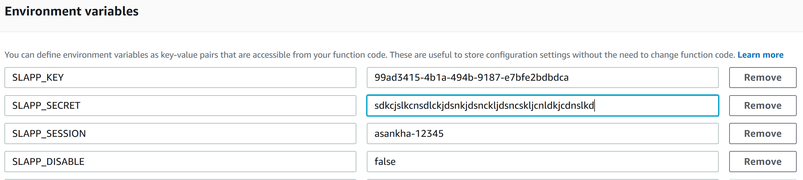

### Setting the Layer and adjusting the timeout and memory

Next select Layers and specify the **SLAppForge Live Debug for AWS - Java** layer by its ARN,
which is the following, at the time of writing this document.

**arn:aws:lambda:us-east-1:892904900711:layer:slappforge-debug-java-1-0-0-build-01:4**

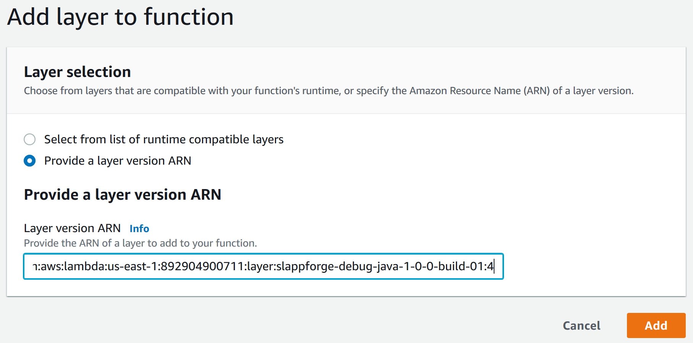

Then change the Runtime of the function from Java 8 or 11, to “Custom runtime”.

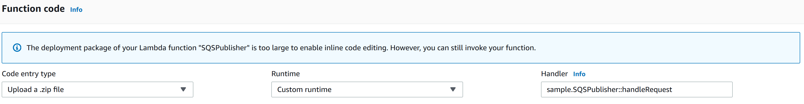

Finally, set a reasonable timeout for the Lambda function, and assign it adequate memory, based on its needs  dependencies. The timeout should be adequate for the debugging session to be used - and might generally be in the range of a few minutes.

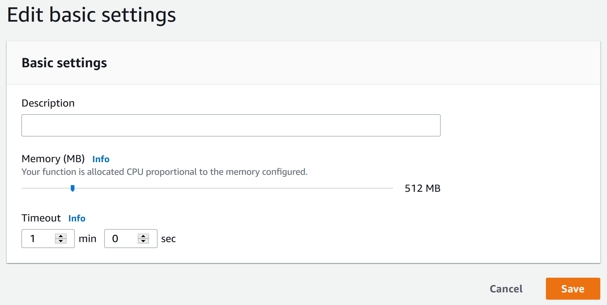

### Setting up the local IDE (IntelliJ IDEA)

Download and extract the IDE Proxy component into a new directory, which can be downloaded as a Zip file from
[here](https://downloads.slappforge.com/debug-java/ide-proxy.zip).
Once extracted, you will find two scripts for Linux and Windows which can be executed.
Edit the relevant script for your environment to have the same environment variables for `SLAPP_KEY`, `SLAPP_SECRET` and `SLAPP_SESSION`.
When you execute the script afterwards, it should show that the proxy connected to the SLAppForge server, as shown below. 

```
C:\Temp\ide-proxy>ide-proxy.bat
06 Feb 2020 19:06:28,273 main IDEProxy : SLAppForge Live Debug for AWS - Java - 1.0.0-build-01
06 Feb 2020 19:06:29,336 main Connected to SLAppForge Debug Server on port 9090!
```

Next, define a Run/Debug configuration for your IDE for remote debugging.
Set the Host to `localhost` and the port to `5005` - which might be default values for your IDE.

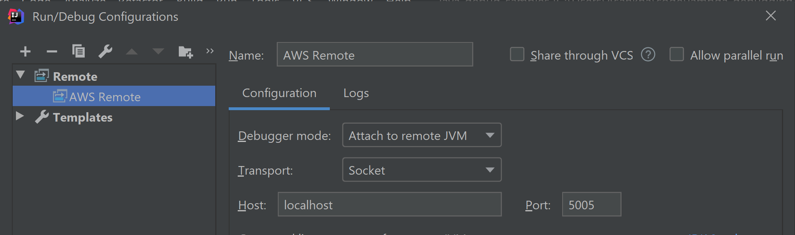

Set a breakpoint on the code, and start the debug session from your IDE. The IDE Proxy should print out the following lines to indicate that its ready for the Lambda function to be triggered.

```
06 Feb 2020 19:18:55,748 main IDE Connected
06 Feb 2020 19:18:56,028 ide-to-svr Ready for the Lambda function to start and connect..
```

Now you can use the **Test** button from the Lambda console to trigger the function, and the IDE will stop at your breakpoint.
Then you can view the local variable `message` and change its value, say to `"Hello Live Debug!"`,
step through, or resume the program to let it continue until end.

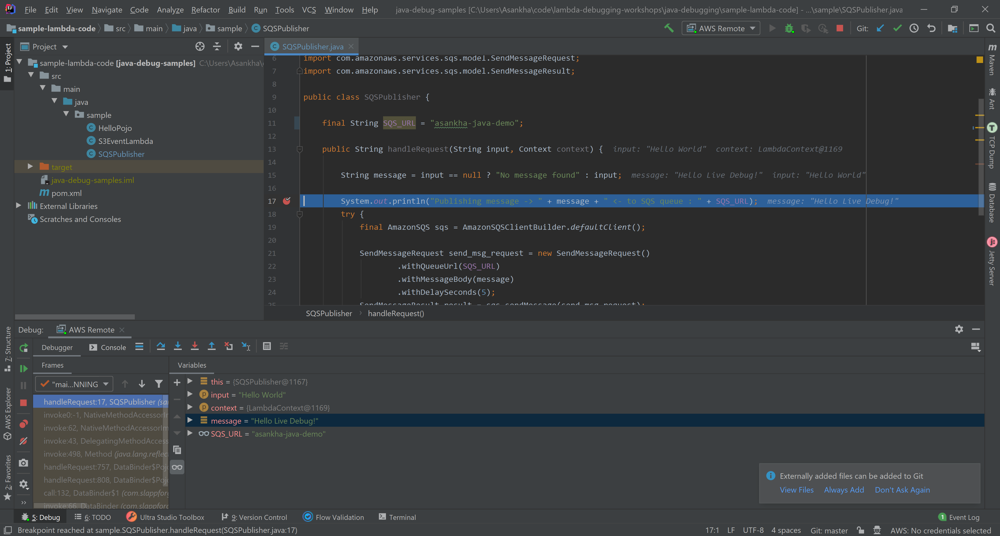

You should now see a successful execution, with the log output similar to the following.

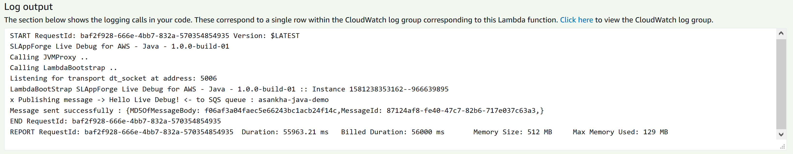

You can let the IDE remain connected to the Lambda function, and Test the function once again with a new request.
Note that AWS Lambda runtime freezes the container executing your function as soon as it completes its execution.
Hence, you might run into issues if you stop the debugging from your IDE, and try to connect back again.
In such cases, simply set an environment variable, or change the existing value of one
(e.g. creating an environment variable say `SLAPP_DUMMY=xyz`) which you could use for this purpose - to force a cold start.
At the same time, you may want to restart the IDE proxy, so that everything can be started again clean.

## 4. Restoring the Lambda function back to its original state

Since we did not have to perform any code changes to remotely debug the Lambda function,
it’s easy to revert things back to how they were before.
To turn off the Lambda function waiting to connect to a debugger, simply set the environment variable **`SLAPP_DISABLE`** to **`true`**.
That should restore the Lambda function to a functionally equivalent deployment in just one step.

To restore the function to its native Java 8 or 11 performance optimized AWS runtime back again, simply remove the Layer we added for debugging, and optionally remove the environment variables, and restore any changes to the timeout and memory allocation, if any.