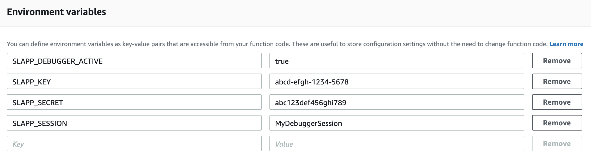

# NodeJS Lambda Debugging Workshop

## 1. Cloning the sample code and set the SQS queue URL

First clone this repository to your local machine and open the `sample-lambda-code` sub directory with your IDE. This 
directory contains is a sample lambda function, which extracts a message from the Lambda `event` and then publishes it 
to a pre-defined SQS queue.

### Setting the SQS URL

For this sample code to work, you need to have a SQS queue created in your AWS account. For that, log into the SQS 
(Simple Queue Service) console of your AWS account and create a new SQS queue. After the queue is created, you can see 
its **URL** and the **ARN** in the **Details** tab as below. Please note them down for later use.


> If you already have a queue that can be used for this activity, that can also be used instead of creating a new one.

* Then open the `index.js` file of the sample code and specify the above Queue URL as the value of the `SQS_URL` constant.

```
const SQS_URL = 'https://sqs.us-east-1.amazonaws.com/123456789000/my-message-queue';
```
---

## 2. Including the SLAppForge Lambda Debug Proxy to the Lambda function

The next step is to include the [SLAppForge Lambda Debug Proxy](https://www.npmjs.com/package/slappforge-lambda-debug-proxy) 
module to the function code. For that, simply add the below `require` statement to the very end of the `index.js` file.

```
require('slappforge-lambda-debug-proxy');
```

Since we are going to provide this module through a Lambda Layer later, it is not required to install this as a npm
dependency (unless you need to run your Lambda code locally). Therefore any warnings indicated by the IDE regarding that
can be safely ignored.

> **Important**
>
> If you intend to use **Visual Studio Code** as the IDE for the debugging, please add a `debugger;` statement as the 
> very first line of the function handler.
> ```
> const AWS = require('aws-sdk');
> let sqs = new AWS.SQS();
> 
> const SQS_URL = '<specify-your-queue-url-here>';
> 
> exports.handler = async (event, context) => {
>   debugger;
>   // rest of the function code
> };
> 
> require('slappforge-lambda-debug-proxy');
> ```

Once this line is added, create a zip file containing the Lambda code to be uploaded to AWS later.

## 3. Creating and configuring the Lambda function

### Create a new Lambda function

Login to the AWS Lambda Console and create a new Lambda function using NodeJS (either 10.x or 12.x) as the runtime. 
Let's name it as **SQSMessagePublisher**. For the execution role configuration, choose the 
**Create a new role with basic Lambda permissions** option.


### Upload the code

Once the Lambda function is created, scroll down to the **Function code** section and choose the **Code Entry Type** as 
**Upload a .zip file**. Then upload the previously created ZIP file containing the sample Lambda code.

Then set the **Handler** name correctly based on how the function code was bundled into the ZIP file. For example, if the
`index.js` is without any enclosing directory, the handler name should be `index.handler`. If `index.js` is enclosed
inside a directory (e.g.: `sample-lambda-code/index.js`), the handler name should be `sample-lambda-code/index.handler`.

### Add the Lambda Debug Proxy Layer

Click on the **Layers** button on the **Designer** section and choose to **Add a layer**. Then select 
**Provide a layer version ARN** option and provide the below layer ARN which contains the `slappforge-lambda-debug-proxy` 
module.

```
arn:aws:lambda:us-east-1:892904900711:layer:slappforge-debug-nodejs-1-0-0-build-01:1
```


### Grant SQS publish permission

Since the Lambda function is supposed to publish messages to the SQS queue, SQS publishing permission should be granted
to the Lambda execution role. For that, switch to the **Permissions** tab on the Lambda function console and click on 
the **Manage these permissions on the IAM console** link.

Once the Lambda execution role is opened in the AWS IAM console, add a **new Inline Policy** with the following parameters.

| Parameter | Value |
|-----------|--------|
|Service    |**SQS** |
|Actions    |**Write -> SendMessage** |
|Resources  |ARN of the SQS queue created in the 1st step|


### Create a test event

To invoke the Lambda function, create a new Test Event on the Lambda console with the following JSON.

```
{
  "message": "Hello World!"
}
```


Then invoke the test event to see if our Lambda code works without any issues. If it was successful, the SQS console can
be used to check if the queue has received the message.

### Configure Lambda environment variables

Then the following environment variables must be set for the Lambda function with the appropriate values. These are used
by the debug proxy to decide whether to enable debug mode and also to connect with the broker server.

| Name | Required | Description  |
|------|:--------:| -------------|
|`SLAPP_DEBUGGER_ACTIVE` |:white_check_mark: | This is the flag that indicates whether the Lambda should be invoked in debug mode or not. Setting this to `true` will enable debugging.
|`SLAPP_KEY` |:white_check_mark: | This is the Access Key obtained from the access key manager
|`SLAPP_SECRET` |:white_check_mark: | This is the Access Secret obtained from the access key manager
|`SLAPP_SESSION` |:white_check_mark: | This is a unique ID to distinguish this Lambda function for debugger to connect. This can be any string value.



Also make sure to set a reasonable **Timeout** value for the Lambda function, so that you have enough time for debugging,
before the Lambda function runs out of time. Generally a timeout of 3-5 minutes would be adequate for a typical debugging
session.

---

## 4. Installing and running the Local Client
      
The Local Client module of the toolkit should be installed as a global NPM dependency on the developer machine.
```
npm i slappforge-debug-client -g
```

Then it can be invoked via a terminal providing the following arguments.

| Short Argument | Long Argument | Required | Description  |
|:---------:|---------|:----------:| -------------|
|`-f` | `--session` |:white_check_mark: | This is a unique ID set as the `SLAPP_SESSION` variable of the Lambda function
|`-k` |`--key` |:white_check_mark: | This is the Access Key obtained from the access key manager
|`-x` |`--secret` |:white_check_mark: | This is the Access Secret obtained from the access key manager
                                                         
```
slp-debug-client -k=abcd-efgh-1234-5678 -x=abc123def456ghi789 -f=MyDebuggerSession
```


---

## 5. Configuring the IDE Debugger
      
**IntelliJ IDEA / WebStorm**

* Open the project containing the Lambda source code and create a new **Run/Debug Configuration** selecting **Attach to 
NodeJS/Chrome** as the type from left side panel
* Provide any name for the Run/Debug profile
* Configure the **Host** as `localhost` and the **Port** as `9249`
* Select the **Attach to** type as `Chrome or NodeJS > 6.3 started with --inspect`
* Click **Apply** and then **OK**


**VS Code**

* Open the workspace containing the Lambda source code and add a new launch configuration similar to below. You can
provide any name for the `name` field.
Launch type: **Node.JS: Attach to Remote**.
```
{
  "type": "node",
  "request": "attach",
  "name": "Attach to Remote Lambda",
  "address": "127.0.0.1",
  "port": 9249,
  "localRoot": "${workspaceFolder}",
  "remoteRoot": "/var/task",
  "outFiles": [
      "${workspaceFolder}/**/*.js"
  ]
}
```
> Based on your VS Code version, the configuration fields may slightly vary.
For example, in 1.46: launch config type = **Node.JS: Attach to Remote**; `type = pwa-node` and `outFiles` becomes `skipFiles`.
* If your Lambda source code is in a sub directory of the current workspace, you have to append that sub path to the 
`localRoot` field.
```
"localRoot": "${workspaceFolder}/subPath"
```

* Similarly, if your Lambda deployment bundle has an enclosing directory, you have to append that also to the 
`remoteRoot` field.
```
"remoteRoot": "/var/task/MyLambda"
```

* Finally save the `launch.json` file

## 6. Running the Debugger 

* First start the **Local Client** providing the necessary parameters as mentioned in step 4.
* Then invoke the Lambda with the previously created test event.
* Then the Lambda execution will suspend waiting for a debugger to connect.
* Finally invoke the Debugger from the IDE and wait for a couple of seconds for it to connect through. If you are using
WebStorm or IntelliJ IDEA, make sure to add at least one debug breakpoint **before** you invoke the IDE debugger, so 
that the Lambda execution will suspend at that point.
* Happy Debugging!
