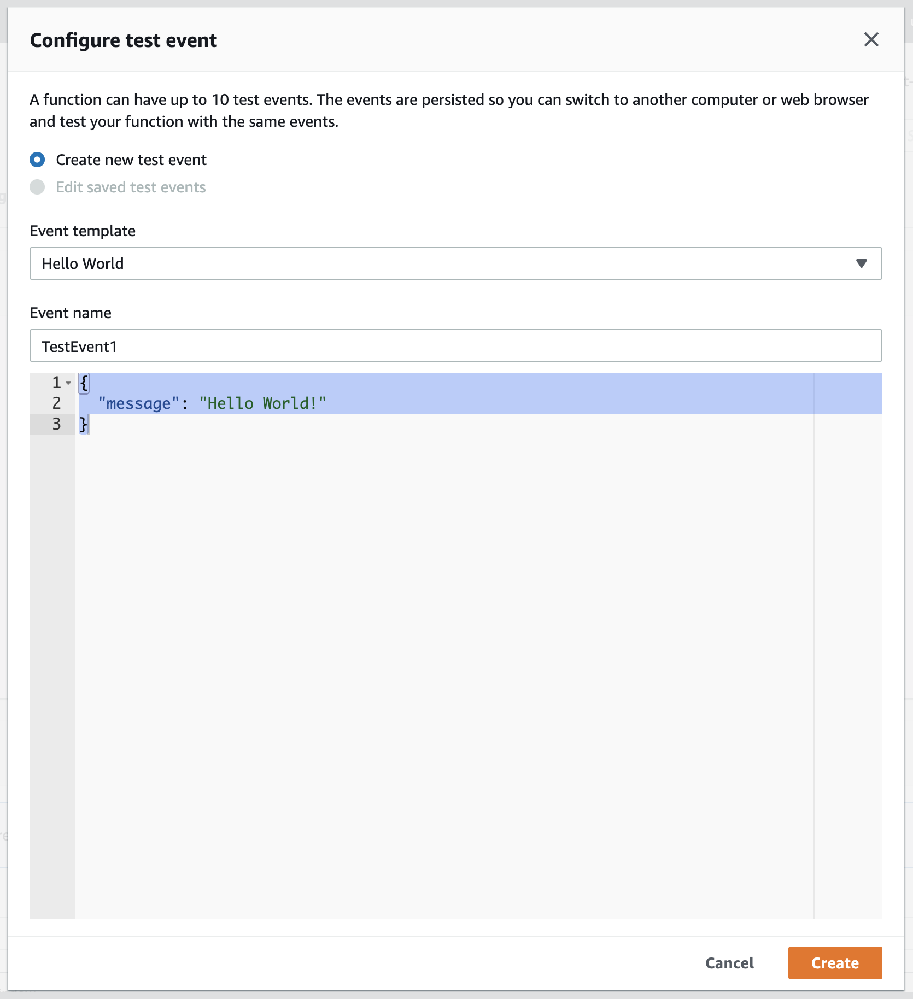

# Python Lambda Debugging Workshop

This writeup guides you with remote debugging your Python Lambda function live on AWS, using your favorite IDE.

> Debugging is currently supported for [JetBrains PyCharm](https://www.jetbrains.com/pycharm/) - stay tuned for VS Code etc.!

## 1. Clone the sample code and set the SQS queue URL

First clone this repository to your local machine and open the `sample_lambda_code` sub directory with your IDE.
This directory contains a sample Lambda function, which extracts a message from the Lambda `event`
and then publishes it to a pre-defined SQS queue.

### Setting the SQS URL

For this sample code to work, you need to have a SQS queue created in your AWS account.
For that, log into the SQS (Simple Queue Service) console of your AWS account and create a new SQS queue.
After the queue is created, you can see its **URL** and the **ARN** in the **Details** tab as below.
Please note them down for later use.


> If you already have a queue that can be used for this activity, that can also be used instead of creating a new one.

* Then open the `index.py` file of the sample code and specify the above Queue URL as the value of the `SQS_URL` constant.

```
SQS_URL = "https://sqs.us-east-1.amazonaws.com/123456789000/my-message-queue"
```
---

## 2. Import the SLAppForge Lambda Debug Proxy module in the Lambda function

The next step is to include the *SLAppForge Python Lambda Debugger module* to the function code.
For that, simply add the appropriate `import` statement to the start of the `index.py` file:

### PyCharm

```
import slappforge_debug_python_pycharm
```

Since we are going to provide this module through a Lambda Layer later, it is not required to be installed as a `pip` package.
Therefore any warnings indicated by the IDE against the import, can be safely ignored.

Once this line is added, create a zip file containing the Lambda code to be uploaded to AWS later.

> If `index.py` is nested inside a directory, make sure that the directory contains an `__init__.py` file.
> (Same goes for any parent directories, leading to the root of the zipfile.)
> Otherwise you may receive a module import error when trying to run/debug your Lambda:
>
> `[ERROR] Runtime.ImportModuleError: Unable to import module 'sample_lambda_code.index': No module named 'sample_lambda_code'`

## 3. Create and configure the Lambda function

### Create a new Lambda function

Log in to the AWS Lambda Console and create a new Lambda function using Python (either 2.7 or 3.x) as the runtime. 
Let's name it as **SQSMessagePublisher**. For the execution role configuration, choose the 
**Create a new role with basic Lambda permissions** option.

### Upload the code

Once the Lambda function is created, scroll down to the **Function code** section and choose the **Code Entry Type** as 
**Upload a .zip file**. Then upload the previously created ZIP file containing the sample Lambda code.

Then set the **Handler** name correctly based on how the function code was bundled into the ZIP file. For example, if the
`index.py` is without any enclosing directory, the handler name should be `index.handler`. If `index.py` is enclosed
inside a directory (e.g.: `sample_lambda_code/index.py`), the handler name should be `sample_lambda_code.index.handler`.

### Add the Lambda Debug Proxy Layer

Click on the **Layers** button on the **Designer** section and choose to **Add a layer**. Then select 
**Provide a layer version ARN** option and provide the appropriate layer ARN:

#### PyCharm

```
arn:aws:lambda:us-east-1:892904900711:layer:slappforge-debug-python-pycharm-1-0-0-build-01:1
```

### Grant SQS publish permission

Since the Lambda function is supposed to publish messages to the SQS queue, SQS publishing permission should be granted
to the Lambda execution role. For that, switch to the **Permissions** tab on the Lambda function console and click on 
the **Manage these permissions on the IAM console** link.

Once the Lambda execution role is opened in the AWS IAM console, add a **new Inline Policy** with the following parameters.

| Parameter | Value |
|-----------|--------|
|Service    |**SQS** |
|Actions    |**Write -> SendMessage** |
|Resources  |ARN of the SQS queue created in the 1st step|


### Create a test event

To invoke the Lambda function, create a new Test Event on the Lambda console with the following JSON.

```
{
  "message": "Hello World!"
}
```



Then invoke the test event to see if our Lambda code works without any issues. If it was successful, the SQS console can
be used to check if the queue has received the message.

### Configure Lambda environment variables

Then the following environment variables must be set for the Lambda function with the appropriate values. These are used
by the debug proxy to decide whether to enable debug mode and also to connect with the broker server.

| Name | Required | Description  |
|------|:--------:| -------------|
|`SLAPP_DEBUGGER_ACTIVE` |:white_check_mark: | This is the flag that indicates whether the Lambda should be invoked in debug mode or not. Setting this to `true` will enable debugging.
|`SLAPP_KEY` |:white_check_mark: | This is the Access Key obtained from the access key manager
|`SLAPP_SECRET` |:white_check_mark: | This is the Access Secret obtained from the access key manager
|`SLAPP_SESSION` |:white_check_mark: | This is a unique ID to distinguish this Lambda function for debugger to connect. This can be any string value.


Also make sure to set a reasonable **Timeout** value for the Lambda function, so that you have enough time for debugging,
before the Lambda function runs out of time. Generally a timeout of 3-5 minutes would be adequate for a typical debugging
session.

---

## 4. Prepare the Local Client

Download and extract the appropriate IDE Proxy component into a new directory:

* [Download for **PyCharm**](http://downloads.slappforge.com/debug-python-pycharm/ide-proxy.zip)

Once extracted, you will find two scripts for Linux and Windows which can be executed.
Edit the relevant script for your environment to have the same environment variables for `SLAPP_KEY`, `SLAPP_SECRET` and `SLAPP_SESSION`.
When you execute the script afterwards, it should show that the proxy connected to the SLAppForge server, as shown below. 

```
C:\Temp\ide-proxy>ide-proxy.bat
06 Feb 2020 19:06:28,273 main IDEProxy : SLAppForge Live Debug for AWS - Python/PyCharm - 1.0.0-build-01
06 Feb 2020 19:06:29,336 main Connected to SLAppForge Debug Server on port 9092
```

As we do not yet have a debugger process running, the local client will automatically shut down within a few seconds.
This is not an issue, and we will start it again in proper sequence during the actual debugging process.

---

## 5. Configure the IDE Debugger

### PyCharm

1. Open the project containing the Lambda source code and create a new **Run/Debug Configuration**
selecting **Python Remote Debug** as the type from left side panel.
2. Provide a suitable name for the Run/Debug profile (or leave the default).
3. Leave the default **Local host name** (`localhost`) and set **Port** to `9000`.
4. Under **Path mappings**, add a new entry
mapping the **absolute path** (e.g. including drive letter, in Windows) of your PyCharm project (local path)
to the relevant location of the deployed Lambda code file (remote path) under `/var/task` (see below)
5. Click **Apply** and then **OK**.

<p align="center">

</p>

> It is not necessary to follow the instructions ("Update your script:" onwards) mentioned in the configuration dialog.

> Relative path of `index.py` should be identical under both "parent" paths that are specified in **Path mappings**:
> * If your project has `index.py` at the project root, *local path* = `<project root>`; while
>   * *remote path* = `/var/task` if your zipfile has `index.py` at its root.
>   * *remote path* = `/var/task/sample_lambda_code` if your zipfile has `index.py` in a `sample_lambda_code` subdirectory.
> * Similarly, if your project has `index.py` in a `sample_lambda_code` subdirectory,
> *local path* = `<project root>/sample_lambda_code`; *remote path* matches the previous example.


## 6. Run the Debugger

1. Launch the debugger from the IDE.
2. Start the **Local Client** providing the necessary parameters as mentioned in step 4.
3. Invoke the Lambda with the previously created test event.
4. In a few seconds, the debugger will show a successful connection,
and the IDE will indicate a breakpoint hit in a utility file (`.../slappforge_debug_python_pycharm/__init__.py`).
5. Now add a breakpoint to a desired line in `index.py`, and click **Resume Program** (F9) to resume the debug session.
6. IDE will pause again at the newly added breakpoint. After this you can debug your remote code as usual
(step-through, inspect variables, evaluate watch expressions, etc.)

Happy Debugging!

## Troubleshooting Tips

* If the IDE times out during the `Waiting for process connection...` state (usually due to delays in invoking the Lambda):
`Connection to Python debugger failed: Timeout waiting for response on 501`:
make sure that you follow **both steps** 1 and 2 when retrying (as the local client would also automatically shut down).
* If you get a warning in the debug console:
`pydev debugger: warning: trying to add breakpoint to file that does not exist: /var/task/.../sample_lambda_code/index.py (will have no effect)`
please revise your file path configurations and ensure that they map to a common root (as explained in Section 5).
* If the debugger session gets disconnected (or you disconnect/restart it manually - such as due to the above issue),
and the Lambda **does not appear to pause** during subsequent debug invocations (even with the breakpoints correctly set),
you may need to **cold start** the Lambda so that it can connect to the debugging infrastructure again.
You can do this easily by changing a field of the Lambda configuration via the console/CLI,
such as adjusting the timeout or adding/changing a dummy environment variable.